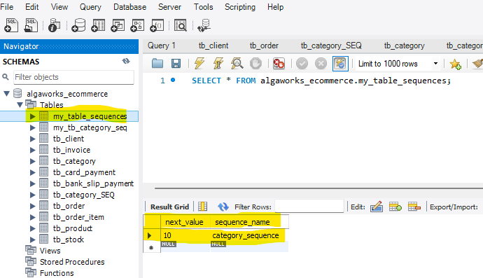

## JPA annotations

When we want to map strict values using java's Enum it's possible to save into the database it's String value. It's safer
than just save it's ordinal value (0, 1, 2, ...) 


### Enum classes

```java
public enum OrderStatus {
    WAITING,
    CANCELLED,
    PAID
}
```

```java
import jakarta.persistence.Entity;
import jakarta.persistence.GeneratedValue;
import jakarta.persistence.Id;
import jakarta.persistence.Table;
import lombok.EqualsAndHashCode;
import lombok.Getter;
import lombok.Setter;

@Getter
@Setter
@EqualsAndHashCode(onlyExplicitlyIncluded = true)
@Entity
@Table(name = "tb_order")
public class Order {
    @EqualsAndHashCode.Include
    @Id
    @GeneratedValue(strategy = GenerationType.IDENTITY)
    private Integer id;
    @Column(name = "create_date")
    private LocalDateTime createDate;
    
    @Enumerated(EnumType.STRING)
    private OrderStatus status;
```

The result will be like this :


### Embeddable classes

Save all data into one table, it would be like appending more attributes to a table.

This way we maintain the principles of Object Orientation on the Java side without having to change the database 
structure.

> @Embeddable

```java
import jakarta.persistence.Column;
import jakarta.persistence.Embeddable;

@Embeddable
public class AddressDeliver {
    @Column(name = "postal_code")
    private String postalCode;
    private String rue;
    private String complement;
    private String province;
    private String city;
}
```
> @Embedded

```java
import jakarta.persistence.Entity;
import jakarta.persistence.GeneratedValue;
import jakarta.persistence.Id;
import jakarta.persistence.Table;
import lombok.EqualsAndHashCode;

@Entity
@Table(name = "tb_order")
public class Order {
    @EqualsAndHashCode.Include
    @Id
    @GeneratedValue(strategy = GenerationType.IDENTITY)
    private Integer id;
    
    @Embedded
    private AddressDeliver address;
```

## Primary Key @GeneratedValue strategies

### GenerationType.AUTO

```java
@Id
@GeneratedValue(strategy = GenerationType.AUTO)
```

With this strategy the implementation of JPA will control the management of the value of the Ids.

In this case, with Hibernate 6, it will create a new table to store the next value of the generated ids:

```shell
Hibernate: 
    create table tb_category_SEQ (
        next_val bigint
    ) engine=InnoDB
Hibernate: 
    insert into tb_category_SEQ values ( 1 )
```


### GenerationType.SEQUENCE

```java
@Id
@GeneratedValue(strategy = GenerationType.SEQUENCE, generator = "my_seq")
@SequenceGenerator(name = "my_seq", sequenceName = "my_tb_category_seq")
```

MySQL does not support SEQUENCE, but hibernate emulates a sequence when using MySQL by creating a TABLE, similar to the 
AUTO Strategy in this case.


### GenerationType.TABLE

```java
@Id
@GeneratedValue(strategy = GenerationType.TABLE, generator = "table_strategy")
@TableGenerator(name = "table_strategy",
        table = "my_table_sequences",
        pkColumnName = "sequence_name",
        pkColumnValue = "category_sequence",
        valueColumnName = "next_value",
        initialValue = 0,
        allocationSize = 10) // default is 50
```

All sequence generators will be stored in a single table with auto generated attributes. It is possible to customise
these attributes as the example below.

```roomsql
-- Hibernate: 
    select
        tbl.next_value 
    from
        my_table_sequences tbl 
    where
        tbl.sequence_name=? for update
-- Hibernate: 
    update
        my_table_sequences 
    set
        next_value=?  
    where
        next_value=? 
        and sequence_name=?
```



### GenerationType.IDENTITY

> This strategy will be used in this project.

```java
@Id
@GeneratedValue(strategy = GenerationType.IDENTITY)
```

This strategy uses the AUTO_INCREMENT statement from MYSQL. For other databases this characteristic will be emulated.

```roomsql
-- Hibernate: 
    create table tb_category (
        id integer not null auto_increment,
        parent_category_id integer,
        name varchar(255),
        primary key (id)
    ) engine=InnoDB
```

For study purposes, all tests must be refactored because of set id used this error will be raised :

```shell
jakarta.persistence.EntityExistsException: detached entity passed to persist: com.code.truck.ecommerce.model.Client
    at org.hibernate.internal.ExceptionConverterImpl.convert(ExceptionConverterImpl.java:126)
    at org.hibernate.internal.ExceptionConverterImpl.convert(ExceptionConverterImpl.java:167)
    at org.hibernate.internal.ExceptionConverterImpl.convert(ExceptionConverterImpl.java:173)
    at org.hibernate.internal.SessionImpl.firePersist(SessionImpl.java:772)
    at org.hibernate.internal.SessionImpl.persist(SessionImpl.java:750)
    at com.code.truck.ecommerce.transactions.CrudClientTests.createClient(CrudClientTests.java:20)
    at java.base/java.lang.reflect.Method.invoke(Method.java:568)
    at java.base/java.util.ArrayList.forEach(ArrayList.java:1511)
    at java.base/java.util.ArrayList.forEach(ArrayList.java:1511)
Caused by: org.hibernate.PersistentObjectException: detached entity passed to persist: com.code.truck.ecommerce.model.Client
    at org.hibernate.event.internal.DefaultPersistEventListener.persist(DefaultPersistEventListener.java:88)
    at org.hibernate.event.internal.DefaultPersistEventListener.onPersist(DefaultPersistEventListener.java:77)
    at org.hibernate.event.internal.DefaultPersistEventListener.onPersist(DefaultPersistEventListener.java:54)
    at org.hibernate.event.service.internal.EventListenerGroupImpl.fireEventOnEachListener(EventListenerGroupImpl.java:127)
    at org.hibernate.internal.SessionImpl.firePersist(SessionImpl.java:766)
    ... 5 more
```

### Transient properties

**@Transient** is a property that will be ignored by JPA, it will not be created into the database nor saved.

### Element collection

#### Simple types


***@ElementCollection*** is used for collections of simple types : String, Integer, etc...

> Use in combination with **@CollectionTable**

```java
import jakarta.persistence.CollectionTable;
import jakarta.persistence.Column;
import jakarta.persistence.ElementCollection;

@Entity
@Table(name = "tb_product")
public class Product {
    // ... code omitted for brevity
    @ElementCollection
    @CollectionTable(name = "tb_product_tag", joinColumns = @JoinColumn(name = "product_id"))
    @Column(name = "tag")
    private List<String> tags;
}
```


#### Embeddable classes


***@ElementCollection*** can be used with embeddable classes :

> Use in combination with : ***@Embeddable*** and ***@CollectionTable***

```java
import jakarta.persistence.Column;
import jakarta.persistence.Embeddable;

@Embeddable
public class Attributes {

    @Column(name = "characteristic_name")
    private String key;

    @Column(name = "characteristic_value")
    private String value;
}
```

```java
import jakarta.persistence.*;

@Entity
@Table(name = "tb_product")
public class Product {
    // ... code omitted for brevity
    @ElementCollection
    @CollectionTable(name = "tb_product_characteristic", joinColumns = @JoinColumn(name = "product_id"))
    private List<Attributes> attributes;
}
```


#### Map of simple types

@ElementCollection can be used to configure tables from ***java.util.Map<K,V>*** as follows :
Use in combination with :

@CollectionTable
@MapKeyColumn

```java
import jakarta.persistence.*;

@Entity
@Table(name = "tb_client")
public class Client {
    // ... code omitted for brevity
    @ElementCollection
    @CollectionTable(
            name = "tb_client_contact_type",
            joinColumns = @JoinColumn(name = "client_id"))
    @MapKeyColumn(name = "type")
    @Column(name = "description")
    private Map<String, String> contactTypes;
}
```


## @Lob

JPA can handle Large objects with the use of @Lob in byte[] class attributes as follows :

```java
import jakarta.persistence.Lob;
import org.hibernate.annotations.JdbcTypeCode;

@Entity
@Table(name = "tb_invoice")
public class Invoice {
    // ... code omitted for brevity
    @Lob
    @JdbcTypeCode(Types.LONGVARBINARY)
    private byte[] xml;

}
```

> @JdbcTypeCode(Types.LONGVARBINARY) will reserve 32600 of length in the database.


> We can control its size with @Column(lenght=...)
> 
> **@Column default length is 255**


## Secondary table

***@SecondaryTable***

***@PrimaryKeyJoinColumn***

***@Column(table = "...")***


```java
import jakarta.persistence.PrimaryKeyJoinColumn;
import jakarta.persistence.SecondaryTable;

@Entity
@Table(name = "tb_client")
@SecondaryTable(name = "tb_client_details", pkJoinColumns = @PrimaryKeyJoinColumn(name = "client_id"))
public class Client {
    @EqualsAndHashCode.Include
    @Id
    @GeneratedValue(strategy = GenerationType.IDENTITY)
    private Integer id;

    @Column(table = "tb_client_details")
    @Enumerated(EnumType.STRING)
    private GenderClient gender;

    @Column(name = "birth_date", table = "tb_client_details")
    private LocalDate birthDate;
}
```