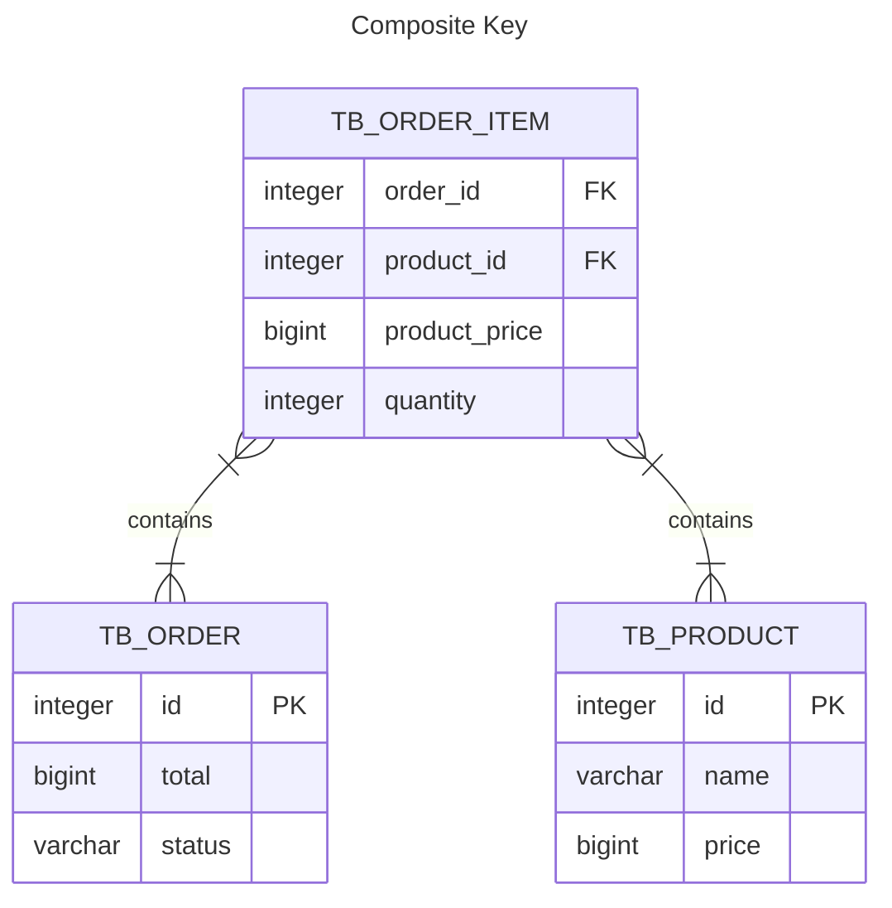
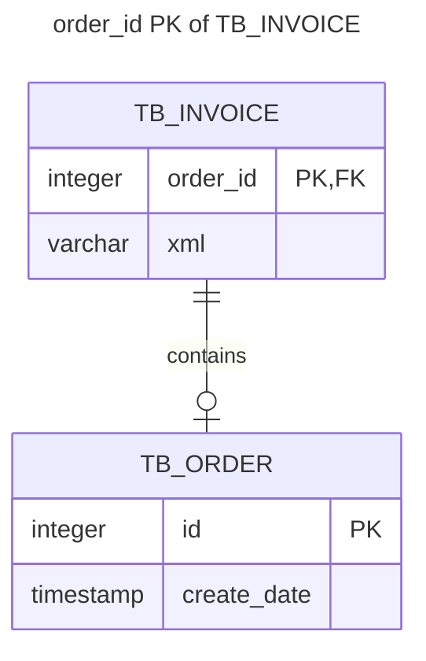

# Mapping Composite Keys



## @IdClass

* Create a class to comport the composite ids :

```java
import lombok.*;

import java.io.Serializable;

@Getter
@Setter
@EqualsAndHashCode(onlyExplicitlyIncluded = true)
@NoArgsConstructor
@AllArgsConstructor
public class OrderItemId implements Serializable {

    @EqualsAndHashCode.Include
    private Integer orderId;

    @EqualsAndHashCode.Include
    private Integer productId;
}
```

> In hibernate 6 the "implements Serializable" is not necessary anymore.

* Replace the @Id/@GeneratedValue with columns that represent the composite keys involved
(in this case: order_id and product_id).

```java
@Getter
@Setter
@EqualsAndHashCode(onlyExplicitlyIncluded = true)
@Entity
@IdClass(OrderItemId.class) // C
@Table(name = "tb_order_item")
public class OrderItem {
    @EqualsAndHashCode.Include
    @Id // A
    @Column(name = "order_id")
    private Integer orderId;

    @EqualsAndHashCode.Include
    @Id // A
    @Column(name = "product_id")
    private Integer productId;

    @ManyToOne(optional = false)
    @JoinColumn(name = "order_id", insertable = false, updatable = false) // B
    private Order order;

    @ManyToOne(optional = false)
    @JoinColumn(name = "product_id", insertable = false, updatable = false) // B
    private Product product;
}
```

> Notes :
>
> A. @Id annotation **MUST** be present for both attributes with the same name mapped on the objects
> 
> B. The objects that represent Order and Product **MUST** be transient, in this case it will work with the properties 
> insertable = false, updatable = false
>
> C. The class **MUST** be annotated with @IdClass(PK.class)

```java
    @Test
    public void verifyCompositeKeysOrderItemOrderIdAndOrderItemProductId() {

        entityManager.getTransaction().begin();

        Product product = entityManager.find(Product.class, 1);
        Client client = entityManager.find(Client.class, 1);

        Order order = new Order();
        order.setTotal(BigDecimal.TEN);
        order.setStatus(OrderStatus.WAITING);
        order.setCreateDate(LocalDateTime.now());
        order.setClient(client);

        entityManager.persist(order); // all entities involved must be persisted...
        entityManager.flush();

        OrderItem orderItem = new OrderItem();
        orderItem.setOrderId(order.getId()); // ... in order to be used in the relationship
        orderItem.setProductId(product.getId());
        orderItem.setOrder(order);
        orderItem.setProduct(product);
        orderItem.setQuantity(1);
        orderItem.setProductPrice(product.getPrice());

        entityManager.persist(orderItem);

        entityManager.getTransaction().commit();
        entityManager.clear();

        OrderItem orderItemToAssert = entityManager.find(
                OrderItem.class, new OrderItemId(1,1)); // we need to use
                                                        // the PK class to find the entity
        Assertions.assertNotNull(orderItemToAssert.getOrder());
        Assertions.assertNotNull(orderItemToAssert.getProduct());
    }
```

## @EmbeddedId

* Create a class to comport the properties of the entities involved :

```java
import jakarta.persistence.Column;
import jakarta.persistence.Embeddable;
import lombok.*;

@Getter
@Setter
@EqualsAndHashCode(onlyExplicitlyIncluded = true)
@NoArgsConstructor
@AllArgsConstructor
@Embeddable
public class OrderItemId {

    @EqualsAndHashCode.Include
    @Column(name = "order_id")
    private Integer orderId;

    @EqualsAndHashCode.Include
    @Column(name = "product_id")
    private Integer productId;
}
```

This class **MUST** have the annotation @Embeddable and any other needed JPA annotation (in this case @Column)

* The class OrderItem need the annotation @EmbeddedId in the property that references the composite key and the 
annotation IdClass is not necessary

```java
@Getter
@Setter
@EqualsAndHashCode(onlyExplicitlyIncluded = true)
@Entity
@Table(name = "tb_order_item")
public class OrderItem {

    @EmbeddedId
    private OrderItemId id;

    @Column(name = "product_price")
    private BigDecimal productPrice;

    private Integer quantity;

    @ManyToOne(optional = false)
    @JoinColumn(name = "order_id", insertable = false, updatable = false)
    private Order order;

    @ManyToOne(optional = false)
    @JoinColumn(name = "product_id", insertable = false, updatable = false)
    private Product product;
}
```

## @MapsId

Used when a table have a Primary Key that is at the same time Foreign Key of another table.

In this project, for example, an Invoice exists when it has an Order in a "One To One" relation.

In this case the Id should be shared between Invoice and Order :



```java
import jakarta.persistence.*;
import lombok.EqualsAndHashCode;
import lombok.Getter;
import lombok.Setter;

import java.util.Date;

@Getter
@Setter
@EqualsAndHashCode(onlyExplicitlyIncluded = true)
@Entity
@Table(name = "tb_invoice")
public class Invoice {
    @EqualsAndHashCode.Include
    @Id
    @Column(name = "order_id")
    private Integer id;

    @MapsId
    @OneToOne(optional = false)
    @JoinColumn(name = "order_id")
    private Order order;

    private String xml;

    @Column(name = "issue_date")
    private Date issueDate;
}
```

> Important : for best readability is the OrderItem where we can use @MapsId to map the composite key eliminating the 
> usage of updatable=false and insertable=false.

```java
@Getter
@Setter
@EqualsAndHashCode(onlyExplicitlyIncluded = true)
@Entity
@Table(name = "tb_order_item")
public class OrderItem {

    @EmbeddedId
    private OrderItemId id;

    @MapsId("orderId")
    @ManyToOne(optional = false)
    @JoinColumn(name = "order_id")
    private Order order;

    @MapsId("productId")
    @ManyToOne(optional = false)
    @JoinColumn(name = "product_id")
    private Product product;

    @Column(name = "product_price")
    private BigDecimal productPrice;

    private Integer quantity;
}
```
