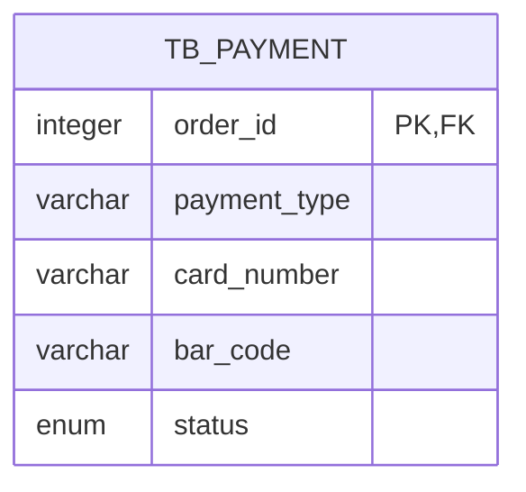

# Inheritance

## @MappedSuperclass

## Strategy Single Table

Case :



Super class or abstract class configuration

```java
import jakarta.persistence.DiscriminatorColumn;
import jakarta.persistence.DiscriminatorType;
import jakarta.persistence.Inheritance;

@Entity(name = "tb_payment")
@Inheritance(strategy = InheritanceType.SINGLE_TABLE)
@DiscriminatorColumn(name = "payment_type", discriminatorType = DiscriminatorType.STRING)
public abstract class Payment extends BaseEntityInteger {

    @MapsId
    @OneToOne(optional = false)
    @JoinColumn(name = "order_id")
    private Order order;

    @Enumerated(EnumType.STRING)
    private PaymentStatus status;
}
```

Concrete classes configuration

```java
import jakarta.persistence.DiscriminatorValue;

@Entity
@DiscriminatorValue("card")
public class CardPayment extends Payment {

    @Column(name = "card_number")
    private String cardNumber;

}
```

```java
import jakarta.persistence.DiscriminatorValue;

@Entity
@DiscriminatorValue("bank_slip")
public class BankSlipPayment extends Payment {

    @Column(name = "bar_code")
    private String barCode;

}
```

## Strategy Table Per Class


## Strategy Joined Table
