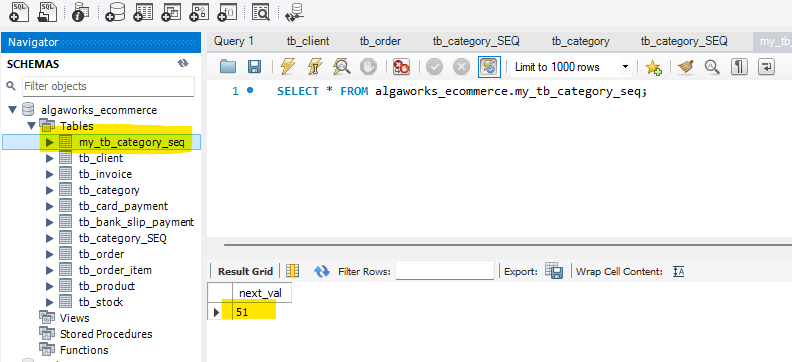

## JPA annotations

```java
@Enumerated(EnumType.STRING)
```

```java
@Embeddable
```

```java
@Embedded
```

## Primary Key @GeneratedValue strategies

### GenerationType.AUTO

```java
@Id
@GeneratedValue(strategy = GenerationType.AUTO)
```

With this strategy the implementation of JPA will control the management of the value of the Ids.

In this case, with Hibernate 6, it will create a new table to store the next value of the generated ids:

```shell
Hibernate: 
    create table tb_category_SEQ (
        next_val bigint
    ) engine=InnoDB
Hibernate: 
    insert into tb_category_SEQ values ( 1 )
```


### GenerationType.SEQUENCE

```java
@Id
@GeneratedValue(strategy = GenerationType.SEQUENCE, generator = "my_seq")
@SequenceGenerator(name = "my_seq", sequenceName = "my_tb_category_seq")
```

MySQL does not support SEQUENCE, but hibernate emulates a sequence when using MySQL by creating a TABLE, similar to the 
AUTO Strategy in this case.



### 
