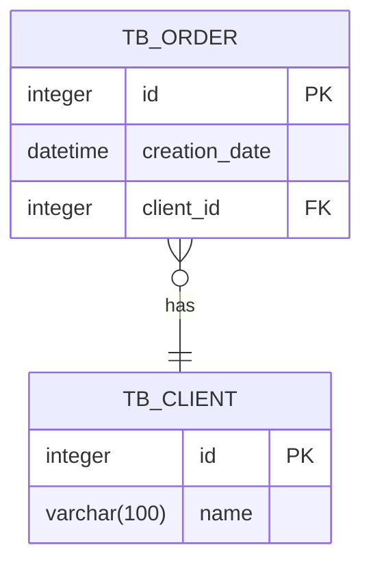
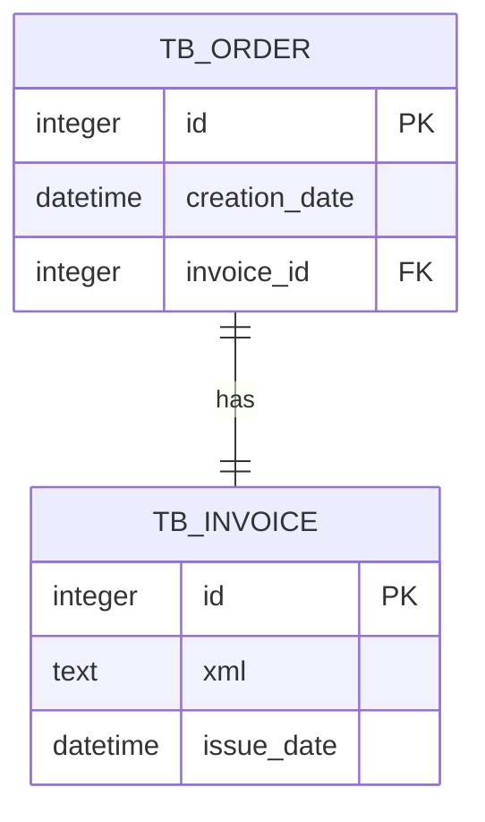
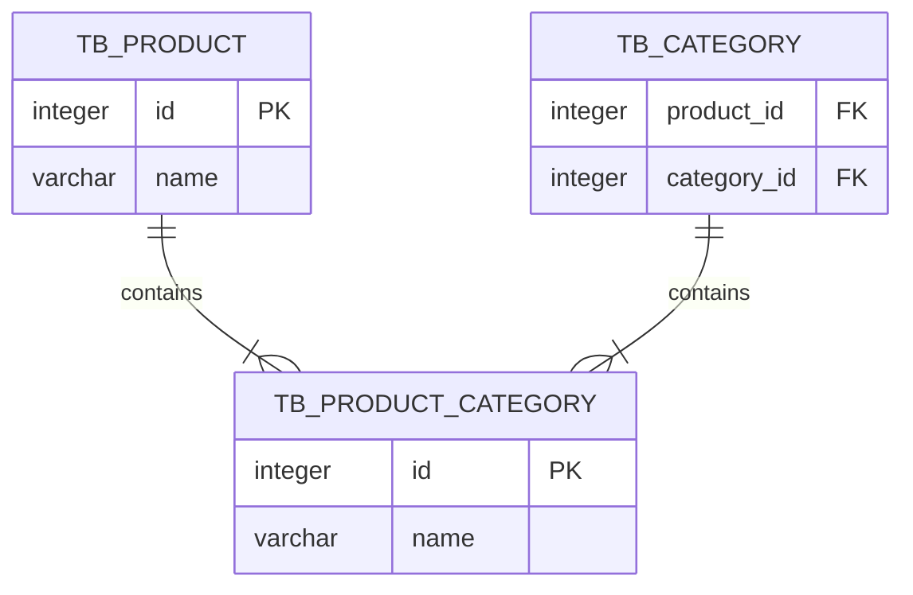

# JPA Relationship Mapping

## Types of relationship

* Many to one
* One to many
* One to one
* Many to many

### Many to one



In java

```java
import com.code.truck.ecommerce.model.Client;
import jakarta.persistence.*;

@Entity
@Table(name = "TB_ORDER")
public class Order {
    @Id
    private Integer id;

    @ManyToOne
    @JoinColumn(name = "client_id")
    private Client client;
}
```

### One to many

```java
import com.code.truck.ecommerce.model.Client;
import com.code.truck.ecommerce.model.Order;
import jakarta.persistence.*;

import java.util.List;

@Entity
@Table(name = "TB_CLIENT")
public class Client {
    @Id
    private Integer id;

    @OneToMany(mappedBy = "client")
    private List<Order> orders;
}
```

### One to one



In java

```java
import com.code.truck.ecommerce.model.Invoice;
import jakarta.persistence.Entity;
import jakarta.persistence.JoinColumn;
import jakarta.persistence.OneToOne;
import jakarta.persistence.Table;

@Entity
@Table(name = "TB_ORDER")
public class Order {
    @Id
    private Integer id;

    @OneToOne
    @JoinColumn(name = "invoice_id")
    private Invoice invoice;
}
```

```java
import com.code.truck.ecommerce.model.Order;
import jakarta.persistence.Entity;
import jakarta.persistence.Id;
import jakarta.persistence.OneToOne;
import jakarta.persistence.Table;

@Entity
@Table(name = "TB_INVOICE")
public class Invoice {
    @Id
    private Integer id;
    private String xml;

    @OneToOne(mappedBy = "invoice")
    private Order order;
}
```

### Many to many



In java

```java
import com.code.truck.ecommerce.model.Category;
import jakarta.persistence.*;

import java.util.List;

@Entity
@Table(name = "TB_PRODUCT")
public class Product {
    @Id
    private Integer id;

    @ManyToMany
    @JoinTable(name = "TB_PRODUCT_CATEGORY",
            joinColumns = @JoinColumn(name = "product_id"),
            inverseJoinColumns = @JoinColumn(name = "category_id"))
    private List<Category> categories;
}
```

```java
import com.code.truck.ecommerce.model.Product;
import jakarta.persistence.Entity;
import jakarta.persistence.Id;
import jakarta.persistence.ManyToMany;
import jakarta.persistence.Table;

import java.util.List;

@Entity
@Table(name = "TB_CATEGORY")
public class Category {
    @Id
    private Integer id;

    @ManyToMany(mappedBy = "categories")
    private List<Product> products;
}
```
