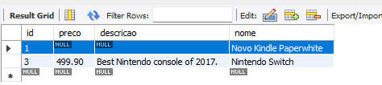

# JPA with hibernate 6

## Docker for mysql

### Start container
```bash
docker run -p 3308:3306 --name mysql_8.0.34 -e "MYSQL_ROOT_PASSWORD=root" -d mysql:8.0.34
```

```bash
docker exec -it mysql_8.0.34 /bin/bash
```

```bash
mysql -u root -p -A
```

```bash
docker ps -a
```

# JPA

## Configuration file

> META-INF/Persistence.xml

## EntityManager

```java
    entityManagerFactory = Persistence.createEntityManagerFactory("Ecommerce-PU");
    entityManager = entityManagerFactory.createEntityManager();
    entityManager.close();
    entityManagerFactory.close();
```

## Transaction Control

```java
// begin a trasaction
entityManager.getTransaction().begin();
    
// database modification commands
entityManager.persist(produto);
entityManager.merge(produto);
entityManager.remove(produto);

// return un object to a previous state
// exemple: 
Produto produto = entityManager.find(Produto.class, 1);
// now produto.getNome() value is "TV"
// we gonna change the name attribute
produto.setNome("Microphone");
entityManager.refresh(produto); // reset entity in the database
// after refresh name will return to the value "TV"
        
// this will transfer all objects in memory to a database
entityManager.flush(); // must be in a transaction control

// end transaction with a commit
entityManager.getTransaction().commit();


// clear the memory (cache) of EntityManager
entityManager.clear();
// this will allow us to "force" JPA to touch database, not just EntityManager's memory cache with the objects
```
### Remove operations

> ERROR: java.lang.IllegalArgumentException: Removing a detached instance ...

```java
Produto produto = new Produto();
produto.setId(3);

entityManager.getTransaction().begin();

entityManager.remove(produto);

entityManager.getTransaction().commit();
```

This error occurs because of JPA does not know the instance of object with id 3.

We need to recover it first from database using a find method in order to remove it.

### Update objects

> entityManager.merge(entity);

With merge() we must inform all attributes of the entity, the attributes not informed will receive null value :

```java
    Produto produto = new Produto();
    produto.setId(1);
    produto.setNome("Novo Kindle Paperwhite");
    //produto.setDescricao("Conheça o novo Kindle, agora com bla, bla bla");
    //produto.setPreco(BigDecimal.valueOf(499.90d));

    entityManager.getTransaction().begin();
    entityManager.merge(produto);
    entityManager.getTransaction().commit();
```

Result :

